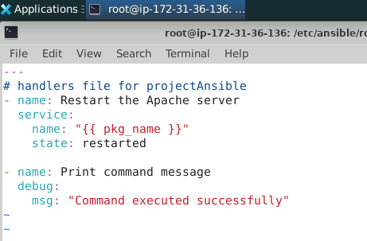
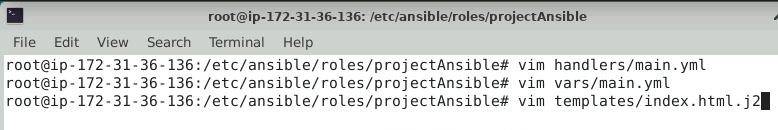

# Ansible-Project-2

=====================================================

## Project Agenda: To deploy a static HTML website with Ansible

## Description:

Ansible is a configuration management tool that you can use to configure servers
and deploy applications. Ansible is free, easy to set up with few dependencies, and
allows you to model complex configuration and deployment workflows.

Learning how to deploy a web application end to end will make you more proficient
in using Ansible.

In this lab, you will learn how to create and configure an Ansible role, and you will
create and configure a role that deploys a web application.

Ansible Roles are a structured way of grouping tasks, handlers, vars, and other
properties. They increase reusability. For this project, we will use two Ubuntu
machines. The first one will be your Ansible controller and the second one will be
your target machine for Apache installation.

## Tools required: Ansible and jinja2

## Expected Deliverables:

- Initialize the directory
- Apply the configuration
- Deploy the website

=====================================================
# Solution:
=====================================================

